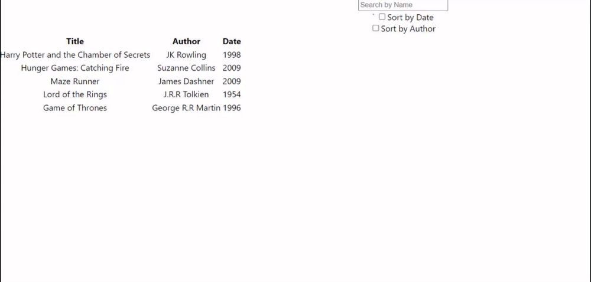

# GraphQL Server with React Application

## Requirements
Core requirements

use React on the client and Apollo Server on the server, other than those you can use whichever technologies you prefer
the schema can either be exposing mock data, or wrapping a public REST API resource of your choosing (bonus points for the latter)

1) client side displays data in a semantic table component
2) further features welcomed (e.g., sorting/filtering)
3) readme must include build instructions, and a list of any extra features
4) provide a GitHub link to the project for review

### Features
1) Sort books by Author names
2) Sort books by Dates
3) Filter/Search books by their titles

#### How to Start
1) First go towards the backend directory, and install the dependancies by entering 'yarn install'
2) Then start the server by entering 'node index.js' which will start an Apollo instance on localhost:4000
3) Change directory to the frontend directory and install the dependancies by entering 'yarn install'
4) Start the client side by entering the command 'yarn start'

#### List of Dependancies
1) Apollo Server Express
2) Express
3) GraphQL
4) Apollo Client
5) Semantic UI
